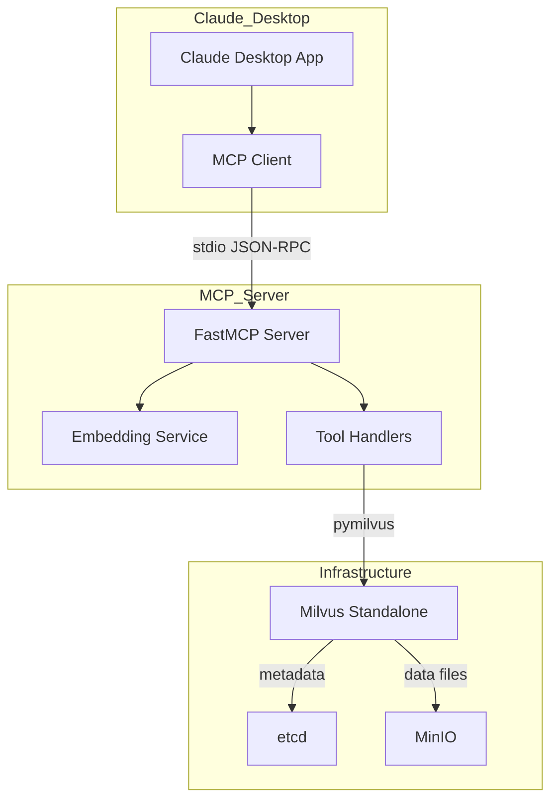
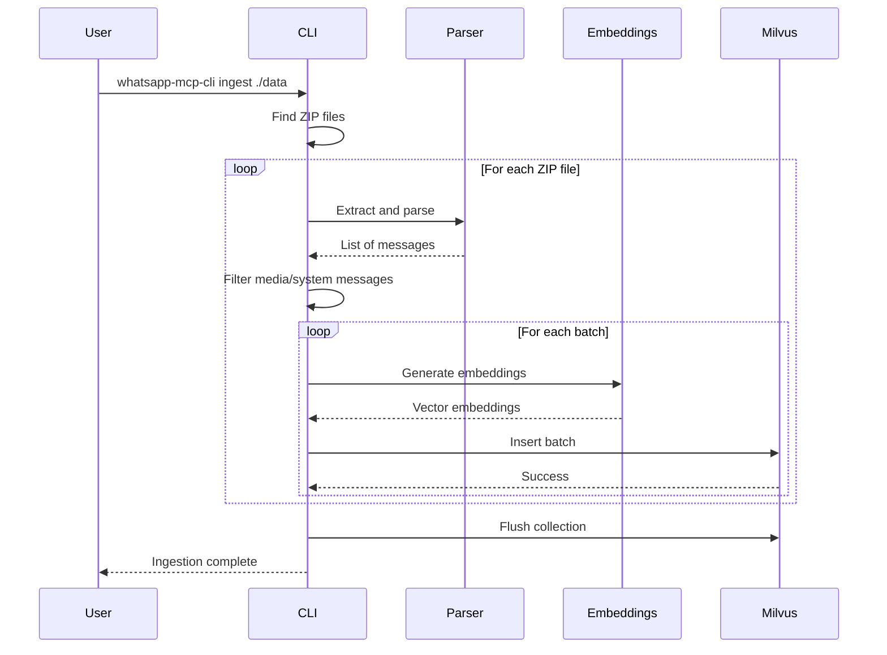
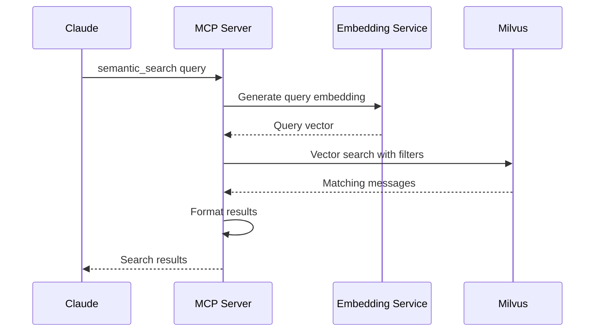

# WhatsApp MCP Server Architecture

> **Version**: 1.0  
> **Date**: January 2026  
> **Status**: Design Document

---

## Table of Contents

1. [System Overview](#1-system-overview)
2. [Infrastructure Components](#2-infrastructure-components)
3. [MCP Server Design](#3-mcp-server-design)
4. [Data Model](#4-data-model)
5. [Data Pipeline](#5-data-pipeline)
6. [Project Structure](#6-project-structure)
7. [Claude Desktop Integration](#7-claude-desktop-integration)

---

## 1. System Overview

### Purpose

The WhatsApp MCP Server enables AI assistants (like Claude) to perform semantic search over WhatsApp conversation exports. Users can search their chat history using natural language queries, filter by date ranges or senders, and retrieve contextually relevant messages.

### Architecture Diagram

```
┌─────────────────────────────────────────────────────────────────────────────────┐
│                              CLAUDE DESKTOP                                      │
│  ┌─────────────────────────────────────────────────────────────────────────┐    │
│  │                         MCP Client                                       │    │
│  │  Connects via stdio transport to spawn and communicate with MCP server   │    │
│  └─────────────────────────────────────────────────────────────────────────┘    │
└─────────────────────────────────────────────────────────────────────────────────┘
                                       │
                                       │ stdio (JSON-RPC)
                                       ▼
┌─────────────────────────────────────────────────────────────────────────────────┐
│                           WHATSAPP MCP SERVER                                    │
│  ┌─────────────────────────────────────────────────────────────────────────┐    │
│  │                         FastMCP Application                              │    │
│  │                                                                          │    │
│  │  Tools:                                                                  │    │
│  │  ├── semantic_search    - Vector similarity search                       │    │
│  │  ├── search_by_date     - Date range filtering with optional semantics   │    │
│  │  ├── search_by_sender   - Filter by participant                          │    │
│  │  └── list_chats         - List available conversations                   │    │
│  │                                                                          │    │
│  │  Components:                                                             │    │
│  │  ├── Embedding Service  - sentence-transformers model                    │    │
│  │  └── Milvus Client      - pymilvus connection                            │    │
│  └─────────────────────────────────────────────────────────────────────────┘    │
└─────────────────────────────────────────────────────────────────────────────────┘
                                       │
                                       │ gRPC (port 19530)
                                       ▼
┌─────────────────────────────────────────────────────────────────────────────────┐
│                           MILVUS STANDALONE                                      │
│  ┌─────────────────────────────────────────────────────────────────────────┐    │
│  │                      Vector Search Engine                                │    │
│  │                                                                          │    │
│  │  Collection: whatsapp_messages                                           │    │
│  │  ├── Vector Index: HNSW (COSINE similarity)                              │    │
│  │  ├── Scalar Indexes: sender, timestamp, chat_id                          │    │
│  │  └── Hybrid Search: Vector + Metadata Filtering                          │    │
│  └─────────────────────────────────────────────────────────────────────────┘    │
└─────────────────────────────────────────────────────────────────────────────────┘
          │                                              │
          │ Metadata (port 2379)                         │ Data Persistence (port 9000)
          ▼                                              ▼
┌─────────────────────────┐                ┌─────────────────────────────────────┐
│         ETCD            │                │              MINIO                   │
│  ┌───────────────────┐  │                │  ┌───────────────────────────────┐  │
│  │ Metadata Storage  │  │                │  │    S3-Compatible Storage      │  │
│  │                   │  │                │  │                               │  │
│  │ - Collection info │  │                │  │  Bucket: milvus-bucket        │  │
│  │ - Index metadata  │  │                │  │  ├── Data files               │  │
│  │ - Cluster state   │  │                │  │  ├── Index files              │  │
│  └───────────────────┘  │                │  │  └── Log snapshots            │  │
└─────────────────────────┘                │  └───────────────────────────────┘  │
                                           └─────────────────────────────────────┘
```

### Data Flow

```
┌──────────────────┐     ┌──────────────────┐     ┌──────────────────┐
│  WhatsApp Chat   │     │    ZIP Parser    │     │   Chat Parser    │
│  Export (.zip)   │────▶│   (extraction)   │────▶│   (whatstk)      │
└──────────────────┘     └──────────────────┘     └────────┬─────────┘
                                                           │
                                                           │ Messages
                                                           ▼
┌──────────────────┐     ┌──────────────────┐     ┌──────────────────┐
│     Milvus       │     │  Batch Insert    │     │   Embedding      │
│   Collection     │◀────│   (pymilvus)     │◀────│   Generation     │
└──────────────────┘     └──────────────────┘     └──────────────────┘
         │
         │ Indexed & Searchable
         ▼
┌──────────────────┐     ┌──────────────────┐     ┌──────────────────┐
│  Claude Desktop  │────▶│   MCP Server     │────▶│  Search Results  │
│  (User Query)    │     │   (FastMCP)      │     │  (Formatted)     │
└──────────────────┘     └──────────────────┘     └──────────────────┘
```

---

## 2. Infrastructure Components

### Component Overview

| Component | Image | Purpose | Ports |
|-----------|-------|---------|-------|
| **Milvus Standalone** | `milvusdb/milvus:v2.4.0` | Vector search engine | 19530 (gRPC), 9091 (metrics) |
| **etcd** | `quay.io/coreos/etcd:v3.5.5` | Metadata storage | 2379 (client) |
| **MinIO** | `minio/minio:RELEASE.2023-03-20T20-16-18Z` | Object storage (S3) | 9000 (API), 9001 (console) |
| **WhatsApp MCP** | Custom build | MCP server | stdio (local) |

### Docker Compose Configuration

```yaml
version: '3.8'

services:
  # ============================================
  # ETCD - Metadata Storage
  # ============================================
  etcd:
    container_name: milvus-etcd
    image: quay.io/coreos/etcd:v3.5.5
    environment:
      - ETCD_AUTO_COMPACTION_MODE=revision
      - ETCD_AUTO_COMPACTION_RETENTION=1000
      - ETCD_QUOTA_BACKEND_BYTES=4294967296
      - ETCD_SNAPSHOT_COUNT=50000
    volumes:
      - etcd_data:/etcd
    command: >
      etcd
      -advertise-client-urls=http://127.0.0.1:2379
      -listen-client-urls=http://0.0.0.0:2379
      --data-dir=/etcd
    healthcheck:
      test: ["CMD", "etcdctl", "endpoint", "health"]
      interval: 30s
      timeout: 20s
      retries: 3
    networks:
      - whatsapp-mcp

  # ============================================
  # MINIO - S3-Compatible Object Storage
  # ============================================
  minio:
    container_name: milvus-minio
    image: minio/minio:RELEASE.2023-03-20T20-16-18Z
    environment:
      MINIO_ACCESS_KEY: minioadmin
      MINIO_SECRET_KEY: minioadmin
    ports:
      - "9001:9001"  # Console UI
      - "9000:9000"  # API
    volumes:
      - minio_data:/minio_data
    command: minio server /minio_data --console-address ":9001"
    healthcheck:
      test: ["CMD", "curl", "-f", "http://localhost:9000/minio/health/live"]
      interval: 30s
      timeout: 20s
      retries: 3
    networks:
      - whatsapp-mcp

  # ============================================
  # MILVUS - Vector Database
  # ============================================
  milvus:
    container_name: milvus-standalone
    image: milvusdb/milvus:v2.4.0
    command: ["milvus", "run", "standalone"]
    security_opt:
      - seccomp:unconfined
    environment:
      ETCD_ENDPOINTS: etcd:2379
      MINIO_ADDRESS: minio:9000
      MINIO_ACCESS_KEY_ID: minioadmin
      MINIO_SECRET_ACCESS_KEY: minioadmin
    volumes:
      - milvus_data:/var/lib/milvus
    healthcheck:
      test: ["CMD", "curl", "-f", "http://localhost:9091/healthz"]
      interval: 30s
      start_period: 90s
      timeout: 20s
      retries: 3
    ports:
      - "19530:19530"  # gRPC API
      - "9091:9091"    # Metrics
    depends_on:
      etcd:
        condition: service_healthy
      minio:
        condition: service_healthy
    networks:
      - whatsapp-mcp

volumes:
  etcd_data:
  minio_data:
  milvus_data:

networks:
  whatsapp-mcp:
    name: whatsapp-mcp
```

### Resource Requirements

| Resource | Minimum | Recommended |
|----------|---------|-------------|
| **CPU** | 2 cores | 4+ cores |
| **Memory** | 8 GB | 16 GB |
| **Disk** | 20 GB | 50+ GB SSD |

> **Note**: For macOS with Apple Silicon (M1/M2/M3), ensure Docker Desktop has at least 8 GB RAM allocated.

---

## 3. MCP Server Design

### Server Configuration

```python
from fastmcp import FastMCP

mcp = FastMCP(
    name="WhatsApp MCP Server",
    instructions="""
    This MCP server provides semantic search capabilities for WhatsApp conversations.
    
    Available tools:
    - semantic_search: Find messages by meaning using natural language queries
    - search_by_date: Search within specific date ranges
    - search_by_sender: Filter messages by participant
    - list_chats: View all available conversations
    
    Tips for effective searches:
    - Use descriptive queries like "discussions about vacation plans"
    - Combine date filters with semantic search for precise results
    - Use list_chats first to see available conversations
    """
)
```

### Tool Definitions

#### 1. `semantic_search` - Primary Search Tool

```python
@mcp.tool
def semantic_search(
    query: str,
    limit: int = 10,
    chat_id: str | None = None
) -> list[dict]:
    """Search WhatsApp messages using semantic similarity.
    
    Finds messages that are semantically similar to the query,
    even if they do not contain the exact words.
    
    Args:
        query: Natural language search query
               Examples: "vacation plans", "birthday party", "work meeting"
        limit: Maximum number of results to return (1-50, default: 10)
        chat_id: Optional chat ID to limit search to a specific conversation
    
    Returns:
        List of matching messages with:
        - content: The message text
        - sender: Who sent the message
        - timestamp: When it was sent (ISO format)
        - chat_id: Which conversation it belongs to
        - score: Relevance score (0-1, higher is better)
    """
```

#### 2. `search_by_date` - Date Range Search

```python
@mcp.tool
def search_by_date(
    start_date: str,
    end_date: str,
    query: str | None = None,
    chat_id: str | None = None,
    limit: int = 20
) -> list[dict]:
    """Search messages within a specific date range.
    
    Can be combined with semantic search for more precise results.
    
    Args:
        start_date: Start date in ISO format (YYYY-MM-DD)
        end_date: End date in ISO format (YYYY-MM-DD)
        query: Optional semantic search query to filter results
        chat_id: Optional chat ID to limit search
        limit: Maximum number of results (default: 20)
    
    Returns:
        List of messages within the date range, optionally
        ranked by semantic relevance if query is provided
    """
```

#### 3. `search_by_sender` - Sender Filter Search

```python
@mcp.tool
def search_by_sender(
    sender: str,
    query: str | None = None,
    chat_id: str | None = None,
    limit: int = 20
) -> list[dict]:
    """Search messages from a specific sender.
    
    Args:
        sender: Name of the sender to filter by (case-insensitive partial match)
        query: Optional semantic search query
        chat_id: Optional chat ID to limit search
        limit: Maximum number of results (default: 20)
    
    Returns:
        List of messages from the specified sender,
        optionally ranked by semantic relevance
    """
```

#### 4. `list_chats` - List Available Conversations

```python
@mcp.tool
def list_chats() -> list[dict]:
    """List all available WhatsApp conversations.
    
    Returns:
        List of chats with:
        - chat_id: Unique identifier for the chat
        - chat_name: Display name of the conversation
        - message_count: Total number of messages
        - participants: List of participant names
        - date_range: First and last message dates
    """
```

### Server Entry Point

```python
# src/whatsapp_mcp/server.py

import argparse
import logging
import os
from fastmcp import FastMCP
from pymilvus import connections, Collection
from sentence_transformers import SentenceTransformer

# Configure logging to stderr (required for stdio transport)
logging.basicConfig(
    level=logging.INFO,
    format='%(asctime)s - %(name)s - %(levelname)s - %(message)s',
    handlers=[logging.StreamHandler()]  # stderr by default
)
logger = logging.getLogger(__name__)

# Initialize FastMCP server
mcp = FastMCP(name="WhatsApp MCP Server", instructions="...")

# Global state (initialized on startup)
collection: Collection | None = None
embedding_model: SentenceTransformer | None = None

@mcp.on_startup
async def startup():
    """Initialize connections on server startup."""
    global collection, embedding_model
    
    # Connect to Milvus
    connections.connect(
        alias="default",
        host=os.getenv("MILVUS_HOST", "localhost"),
        port=os.getenv("MILVUS_PORT", "19530")
    )
    
    # Load collection
    collection = Collection("whatsapp_messages")
    collection.load()
    
    # Load embedding model
    model_name = os.getenv(
        "EMBEDDING_MODEL",
        "paraphrase-multilingual-mpnet-base-v2"
    )
    embedding_model = SentenceTransformer(model_name)
    
    logger.info("WhatsApp MCP Server initialized successfully")

@mcp.on_shutdown
async def shutdown():
    """Cleanup on server shutdown."""
    if collection:
        collection.release()
    connections.disconnect("default")
    logger.info("WhatsApp MCP Server shut down")

# Tool definitions here...

def main():
    """Entry point for the MCP server."""
    parser = argparse.ArgumentParser(description="WhatsApp MCP Server")
    parser.add_argument(
        "--transport",
        choices=["stdio", "http"],
        default="stdio",
        help="Transport type (default: stdio for Claude Desktop)"
    )
    parser.add_argument("--host", default="0.0.0.0")
    parser.add_argument("--port", type=int, default=8000)
    
    args = parser.parse_args()
    
    if args.transport == "http":
        mcp.run(transport="http", host=args.host, port=args.port)
    else:
        mcp.run(transport="stdio")

if __name__ == "__main__":
    main()
```

---

## 4. Data Model

### Milvus Collection Schema

```python
from pymilvus import (
    CollectionSchema,
    FieldSchema,
    DataType,
    Collection
)

# Field definitions
fields = [
    # Primary key - auto-generated unique ID
    FieldSchema(
        name="id",
        dtype=DataType.INT64,
        is_primary=True,
        auto_id=True,
        description="Auto-generated message ID"
    ),
    
    # Message content (searchable text)
    FieldSchema(
        name="content",
        dtype=DataType.VARCHAR,
        max_length=65535,
        description="Message text content"
    ),
    
    # Sender name
    FieldSchema(
        name="sender",
        dtype=DataType.VARCHAR,
        max_length=256,
        description="Name of the message sender"
    ),
    
    # Unix timestamp
    FieldSchema(
        name="timestamp",
        dtype=DataType.INT64,
        description="Message timestamp (Unix epoch seconds)"
    ),
    
    # Chat identifier (derived from filename)
    FieldSchema(
        name="chat_id",
        dtype=DataType.VARCHAR,
        max_length=256,
        description="Unique identifier for the conversation"
    ),
    
    # Chat display name
    FieldSchema(
        name="chat_name",
        dtype=DataType.VARCHAR,
        max_length=256,
        description="Human-readable chat name"
    ),
    
    # Vector embedding
    FieldSchema(
        name="embedding",
        dtype=DataType.FLOAT_VECTOR,
        dim=768,  # paraphrase-multilingual-mpnet-base-v2 dimension
        description="Semantic embedding vector"
    )
]

# Create schema
schema = CollectionSchema(
    fields=fields,
    description="WhatsApp chat messages with semantic embeddings",
    enable_dynamic_field=False
)

# Create collection
collection = Collection(
    name="whatsapp_messages",
    schema=schema,
    consistency_level="Bounded"  # Good balance of consistency and performance
)
```

### Index Configuration

```python
# Vector index - HNSW for fast approximate nearest neighbor search
vector_index_params = {
    "index_type": "HNSW",
    "metric_type": "COSINE",  # Cosine similarity for text embeddings
    "params": {
        "M": 16,              # Max connections per node (higher = more accurate, more memory)
        "efConstruction": 256  # Build-time search width (higher = better quality index)
    }
}

collection.create_index(
    field_name="embedding",
    index_params=vector_index_params,
    index_name="embedding_hnsw_idx"
)

# Scalar indexes for filtering
# Sender index - for filtering by participant
collection.create_index(
    field_name="sender",
    index_params={"index_type": "INVERTED"},
    index_name="sender_idx"
)

# Timestamp index - for date range queries
collection.create_index(
    field_name="timestamp",
    index_params={"index_type": "STL_SORT"},
    index_name="timestamp_idx"
)

# Chat ID index - for filtering by conversation
collection.create_index(
    field_name="chat_id",
    index_params={"index_type": "INVERTED"},
    index_name="chat_id_idx"
)
```

### Search Parameters

```python
# Search parameters for queries
search_params = {
    "metric_type": "COSINE",
    "params": {
        "ef": 64  # Search-time accuracy (higher = more accurate, slower)
    }
}

# Example search with filtering
results = collection.search(
    data=[query_embedding],
    anns_field="embedding",
    param=search_params,
    limit=10,
    expr='chat_id == "chat_123" and timestamp >= 1704067200',
    output_fields=["content", "sender", "timestamp", "chat_id", "chat_name"]
)
```

### Schema Diagram

```
┌─────────────────────────────────────────────────────────────────┐
│                    whatsapp_messages Collection                  │
├─────────────────────────────────────────────────────────────────┤
│ Field          │ Type          │ Index       │ Description      │
├────────────────┼───────────────┼─────────────┼──────────────────┤
│ id             │ INT64 (PK)    │ -           │ Auto-generated   │
│ content        │ VARCHAR       │ -           │ Message text     │
│ sender         │ VARCHAR       │ INVERTED    │ Sender name      │
│ timestamp      │ INT64         │ STL_SORT    │ Unix timestamp   │
│ chat_id        │ VARCHAR       │ INVERTED    │ Chat identifier  │
│ chat_name      │ VARCHAR       │ -           │ Chat display name│
│ embedding      │ FLOAT_VECTOR  │ HNSW        │ 768-dim vector   │
└─────────────────────────────────────────────────────────────────┘
```

---

## 5. Data Pipeline

### Pipeline Overview

```
┌─────────────┐    ┌─────────────┐    ┌─────────────┐    ┌─────────────┐
│  ZIP Files  │───▶│  Extract    │───▶│   Parse     │───▶│  Validate   │
│  (data/)    │    │  _chat.txt  │    │  Messages   │    │  & Clean    │
└─────────────┘    └─────────────┘    └─────────────┘    └─────────────┘
                                                                │
                                                                ▼
┌─────────────┐    ┌─────────────┐    ┌─────────────┐    ┌─────────────┐
│   Milvus    │◀───│   Batch     │◀───│  Generate   │◀───│  Prepare    │
│  Collection │    │   Insert    │    │  Embeddings │    │  Batches    │
└─────────────┘    └─────────────┘    └─────────────┘    └─────────────┘
```

### CLI Ingestion Command

```python
# src/whatsapp_mcp/cli.py

import click
import zipfile
from pathlib import Path
from .parser import parse_whatsapp_chat
from .embeddings import EmbeddingService
from .milvus_client import MilvusClient

@click.group()
def cli():
    """WhatsApp MCP CLI tools."""
    pass

@cli.command()
@click.argument('data_dir', type=click.Path(exists=True))
@click.option('--batch-size', default=100, help='Batch size for insertion')
@click.option('--milvus-host', default='localhost', help='Milvus host')
@click.option('--milvus-port', default=19530, help='Milvus port')
def ingest(data_dir: str, batch_size: int, milvus_host: str, milvus_port: int):
    """Ingest WhatsApp chat exports from ZIP files.
    
    DATA_DIR: Directory containing WhatsApp chat ZIP exports
    """
    data_path = Path(data_dir)
    zip_files = list(data_path.glob("*.zip"))
    
    if not zip_files:
        click.echo(f"No ZIP files found in {data_dir}")
        return
    
    click.echo(f"Found {len(zip_files)} ZIP file(s) to process")
    
    # Initialize services
    embedding_service = EmbeddingService()
    milvus_client = MilvusClient(host=milvus_host, port=milvus_port)
    milvus_client.ensure_collection()
    
    total_messages = 0
    
    for zip_path in zip_files:
        click.echo(f"\nProcessing: {zip_path.name}")
        
        # Extract chat name from filename
        # "WhatsApp Chat - John Doe.zip" -> "John Doe"
        chat_name = zip_path.stem.replace("WhatsApp Chat - ", "")
        chat_id = chat_name.lower().replace(" ", "_")
        
        # Extract and parse
        messages = extract_and_parse(zip_path)
        click.echo(f"  Parsed {len(messages)} messages")
        
        # Filter out media/system messages
        text_messages = [m for m in messages if not m.is_media and not m.is_system]
        click.echo(f"  {len(text_messages)} text messages after filtering")
        
        # Process in batches
        for i in range(0, len(text_messages), batch_size):
            batch = text_messages[i:i + batch_size]
            
            # Generate embeddings
            contents = [m.content for m in batch]
            embeddings = embedding_service.encode_batch(contents)
            
            # Prepare data for insertion
            data = {
                "content": contents,
                "sender": [m.sender for m in batch],
                "timestamp": [int(m.timestamp.timestamp()) for m in batch],
                "chat_id": [chat_id] * len(batch),
                "chat_name": [chat_name] * len(batch),
                "embedding": embeddings
            }
            
            # Insert into Milvus
            milvus_client.insert(data)
            click.echo(f"  Inserted batch {i // batch_size + 1}")
        
        total_messages += len(text_messages)
    
    # Flush and build indexes
    milvus_client.flush()
    click.echo(f"\nTotal messages ingested: {total_messages}")

def extract_and_parse(zip_path: Path) -> list:
    """Extract ZIP and parse the chat file."""
    with zipfile.ZipFile(zip_path, 'r') as zf:
        # Find the chat file (usually _chat.txt)
        chat_files = [f for f in zf.namelist() if f.endswith('.txt')]
        if not chat_files:
            raise ValueError(f"No .txt file found in {zip_path}")
        
        chat_file = chat_files[0]
        with zf.open(chat_file) as f:
            content = f.read().decode('utf-8')
    
    return parse_whatsapp_chat(content)

if __name__ == "__main__":
    cli()
```

### WhatsApp Parser Module

```python
# src/whatsapp_mcp/parser.py

import re
from dataclasses import dataclass
from datetime import datetime
from typing import Optional

@dataclass
class WhatsAppMessage:
    """Represents a single WhatsApp message."""
    timestamp: datetime
    sender: str
    content: str
    is_media: bool = False
    is_system: bool = False

# Regex patterns for different WhatsApp export formats
PATTERNS = [
    # Android: "12/25/23, 14:30 - Name: Message"
    r'^(\d{1,2}/\d{1,2}/\d{2,4}),?\s*(\d{1,2}:\d{2}(?::\d{2})?(?:\s*[AP]M)?)\s*-\s*([^:]+):\s*(.+)$',
    # iOS: "[12/25/23, 2:30:45 PM] Name: Message"
    r'^\[(\d{1,2}/\d{1,2}/\d{2,4}),?\s*(\d{1,2}:\d{2}(?::\d{2})?(?:\s*[AP]M)?)\]\s*([^:]+):\s*(.+)$',
    # French: "25/12/2023 à 14:30 - Name: Message"
    r'^(\d{1,2}/\d{1,2}/\d{2,4})\s*[àa]\s*(\d{1,2}:\d{2}(?::\d{2})?)\s*-\s*([^:]+):\s*(.+)$',
]

MEDIA_INDICATORS = [
    '<media omitted>',
    '<image omitted>',
    '<video omitted>',
    '<audio omitted>',
    '<document omitted>',
    '<sticker omitted>',
    '<gif omitted>',
]

SYSTEM_INDICATORS = [
    'messages and calls are end-to-end encrypted',
    'created group',
    'added you',
    'left the group',
    'changed the subject',
    'changed this group',
]

def parse_whatsapp_chat(content: str) -> list[WhatsAppMessage]:
    """Parse WhatsApp chat export content into messages."""
    messages = []
    current_message: Optional[WhatsAppMessage] = None
    
    for line in content.split('\n'):
        # Remove BOM and special characters
        line = line.strip('\ufeff\u200e\u200f\r')
        
        if not line:
            continue
        
        parsed = _parse_line(line)
        
        if parsed:
            if current_message:
                messages.append(current_message)
            current_message = parsed
        elif current_message:
            # Multi-line message continuation
            current_message.content += '\n' + line
    
    if current_message:
        messages.append(current_message)
    
    return messages

def _parse_line(line: str) -> Optional[WhatsAppMessage]:
    """Attempt to parse a single line as a message."""
    for pattern in PATTERNS:
        match = re.match(pattern, line, re.UNICODE | re.IGNORECASE)
        if match:
            date_str, time_str, sender, content = match.groups()
            
            # Detect media messages
            is_media = any(ind in content.lower() for ind in MEDIA_INDICATORS)
            
            # Detect system messages
            is_system = any(ind in content.lower() for ind in SYSTEM_INDICATORS)
            
            return WhatsAppMessage(
                timestamp=_parse_datetime(date_str, time_str),
                sender=sender.strip(),
                content=content.strip(),
                is_media=is_media,
                is_system=is_system
            )
    
    return None

def _parse_datetime(date_str: str, time_str: str) -> datetime:
    """Parse date and time strings into datetime object."""
    # Try multiple date formats
    date_formats = [
        "%m/%d/%y", "%m/%d/%Y",  # US format
        "%d/%m/%y", "%d/%m/%Y",  # European format
    ]
    
    time_formats = [
        "%H:%M", "%H:%M:%S",           # 24-hour
        "%I:%M %p", "%I:%M:%S %p",     # 12-hour with AM/PM
    ]
    
    for date_fmt in date_formats:
        for time_fmt in time_formats:
            try:
                combined = f"{date_str} {time_str}"
                return datetime.strptime(combined, f"{date_fmt} {time_fmt}")
            except ValueError:
                continue
    
    # Fallback: return current time if parsing fails
    return datetime.now()
```

### Embedding Service Module

```python
# src/whatsapp_mcp/embeddings.py

from sentence_transformers import SentenceTransformer

class EmbeddingService:
    """Service for generating text embeddings."""
    
    def __init__(self, model_name: str = "paraphrase-multilingual-mpnet-base-v2"):
        """Initialize the embedding model.
        
        Args:
            model_name: HuggingFace model name for sentence-transformers
        """
        self.model = SentenceTransformer(model_name)
        self.dimension = self.model.get_sentence_embedding_dimension()
    
    def encode(self, text: str) -> list[float]:
        """Generate embedding for a single text."""
        return self.model.encode(text, normalize_embeddings=True).tolist()
    
    def encode_batch(self, texts: list[str], batch_size: int = 32) -> list[list[float]]:
        """Generate embeddings for multiple texts.
        
        Args:
            texts: List of text strings to encode
            batch_size: Batch size for encoding (affects memory usage)
        
        Returns:
            List of embedding vectors
        """
        embeddings = self.model.encode(
            texts,
            batch_size=batch_size,
            normalize_embeddings=True,
            show_progress_bar=True
        )
        return embeddings.tolist()
```

---

## 6. Project Structure

### Directory Layout

```
whatsapp-mcp/
├── pyproject.toml              # Project configuration and dependencies
├── README.md                   # Project documentation
├── docker-compose.yml          # Infrastructure orchestration
├── .env.example                # Environment variable template
├── .gitignore                  # Git ignore rules
│
├── src/
│   └── whatsapp_mcp/
│       ├── __init__.py         # Package initialization
│       ├── server.py           # FastMCP server entry point
│       ├── cli.py              # CLI commands (ingest, etc.)
│       ├── parser.py           # WhatsApp chat parser
│       ├── embeddings.py       # Embedding service
│       ├── milvus_client.py    # Milvus database client
│       └── config.py           # Configuration management
│
├── data/                       # WhatsApp chat exports (gitignored)
│   ├── WhatsApp Chat - Astride Zircon.zip
│   ├── WhatsApp Chat - Lynn_Kyne.zip
│   └── WhatsApp Chat - Stephanie Ange.zip
│
├── docs/
│   ├── ARCHITECTURE.md         # This document
│   └── RESEARCH.md             # Technical research
│
├── tests/
│   ├── __init__.py
│   ├── test_parser.py          # Parser unit tests
│   ├── test_embeddings.py      # Embedding tests
│   └── test_server.py          # MCP server tests
│
└── volumes/                    # Docker volumes (gitignored)
    ├── etcd/
    ├── minio/
    └── milvus/
```

### pyproject.toml Configuration

```toml
[project]
name = "whatsapp-mcp"
version = "0.1.0"
description = "MCP server for semantic search of WhatsApp conversations"
readme = "README.md"
requires-python = ">=3.11"
license = { text = "MIT" }
authors = [
    { name = "Your Name", email = "your.email@example.com" }
]
keywords = ["mcp", "whatsapp", "semantic-search", "milvus", "fastmcp"]
classifiers = [
    "Development Status :: 3 - Alpha",
    "Intended Audience :: Developers",
    "License :: OSI Approved :: MIT License",
    "Programming Language :: Python :: 3.11",
    "Programming Language :: Python :: 3.12",
]

dependencies = [
    "fastmcp>=2.0.0,<3",
    "pymilvus>=2.4.0",
    "sentence-transformers>=2.2.0",
    "click>=8.0.0",
]

[project.optional-dependencies]
dev = [
    "pytest>=7.0.0",
    "pytest-asyncio>=0.21.0",
    "pytest-cov>=4.0.0",
    "ruff>=0.1.0",
    "mypy>=1.0.0",
]

[project.scripts]
whatsapp-mcp = "whatsapp_mcp.server:main"
whatsapp-mcp-cli = "whatsapp_mcp.cli:cli"

[build-system]
requires = ["hatchling"]
build-backend = "hatchling.build"

[tool.hatch.build.targets.wheel]
packages = ["src/whatsapp_mcp"]

[tool.ruff]
line-length = 100
target-version = "py311"

[tool.ruff.lint]
select = ["E", "F", "I", "N", "W", "UP", "B", "C4"]
ignore = ["E501"]  # Line length handled by formatter

[tool.ruff.lint.isort]
known-first-party = ["whatsapp_mcp"]

[tool.mypy]
python_version = "3.11"
strict = true
warn_return_any = true
warn_unused_ignores = true

[tool.pytest.ini_options]
asyncio_mode = "auto"
testpaths = ["tests"]
addopts = "-v --cov=whatsapp_mcp --cov-report=term-missing"
```

### Environment Configuration

```bash
# .env.example

# Milvus Configuration
MILVUS_HOST=localhost
MILVUS_PORT=19530

# MinIO Configuration (for direct access if needed)
MINIO_HOST=localhost
MINIO_PORT=9000
MINIO_ACCESS_KEY=minioadmin
MINIO_SECRET_KEY=minioadmin

# Embedding Model
EMBEDDING_MODEL=paraphrase-multilingual-mpnet-base-v2

# Logging
LOG_LEVEL=INFO
```

### .gitignore

```gitignore
# Python
__pycache__/
*.py[cod]
*$py.class
*.so
.Python
build/
develop-eggs/
dist/
downloads/
eggs/
.eggs/
lib/
lib64/
parts/
sdist/
var/
wheels/
*.egg-info/
.installed.cfg
*.egg

# Virtual environments
.venv/
venv/
ENV/

# IDE
.idea/
.vscode/
*.swp
*.swo

# Testing
.pytest_cache/
.coverage
htmlcov/
.tox/
.nox/

# Type checking
.mypy_cache/

# Docker volumes (local data)
volumes/

# Environment
.env
.env.local

# Data files (contain personal conversations)
data/*.zip
data/*.txt

# macOS
.DS_Store

# Logs
*.log
```

---

## 7. Claude Desktop Integration

### Configuration File Location

| Operating System | Configuration Path |
|------------------|-------------------|
| **macOS** | `~/Library/Application Support/Claude/claude_desktop_config.json` |
| **Windows** | `%APPDATA%\Claude\claude_desktop_config.json` |
| **Linux** | `~/.config/Claude/claude_desktop_config.json` |

### Configuration with uv (Recommended)

This configuration uses `uv` to manage the Python environment and dependencies automatically:

```json
{
  "mcpServers": {
    "whatsapp-search": {
      "command": "uv",
      "args": [
        "--directory",
        "/absolute/path/to/whatsapp-mcp",
        "run",
        "whatsapp-mcp"
      ],
      "env": {
        "MILVUS_HOST": "localhost",
        "MILVUS_PORT": "19530",
        "EMBEDDING_MODEL": "paraphrase-multilingual-mpnet-base-v2"
      }
    }
  }
}
```

### Alternative: Direct Python Execution

If you prefer to use a pre-configured virtual environment:

```json
{
  "mcpServers": {
    "whatsapp-search": {
      "command": "/absolute/path/to/whatsapp-mcp/.venv/bin/python",
      "args": [
        "-m",
        "whatsapp_mcp.server"
      ],
      "env": {
        "MILVUS_HOST": "localhost",
        "MILVUS_PORT": "19530"
      }
    }
  }
}
```

### Setup Steps

1. **Start Infrastructure**
   ```bash
   cd /path/to/whatsapp-mcp
   docker compose up -d
   ```

2. **Install Dependencies**
   ```bash
   # Using uv (recommended)
   uv venv
   uv pip install -e .
   
   # Or using pip
   python -m venv .venv
   source .venv/bin/activate  # or .venv\Scripts\activate on Windows
   pip install -e .
   ```

3. **Ingest Data**
   ```bash
   # Using uv
   uv run whatsapp-mcp-cli ingest ./data
   
   # Or with activated venv
   whatsapp-mcp-cli ingest ./data
   ```

4. **Configure Claude Desktop**
   - Edit the configuration file at the appropriate path
   - Add the `whatsapp-search` server configuration
   - Save the file

5. **Restart Claude Desktop**
   - Quit Claude Desktop completely
   - Reopen Claude Desktop
   - The MCP server should connect automatically

### Verification

After configuration, verify the integration:

1. Open Claude Desktop
2. Go to **Settings** → **Developer** → **MCP Servers**
3. Verify "whatsapp-search" shows status "running"
4. Test with a query:
   > "Search my WhatsApp messages for discussions about vacation"

### Troubleshooting

| Issue | Solution |
|-------|----------|
| Server not starting | Check that Milvus is running: `docker compose ps` |
| Connection refused | Verify `MILVUS_HOST` and `MILVUS_PORT` in config |
| No results | Ensure data was ingested: `whatsapp-mcp-cli ingest ./data` |
| Model loading slow | First run downloads the embedding model (~400MB) |

### Logs

To view MCP server logs:

```bash
# macOS
tail -f ~/Library/Logs/Claude/mcp*.log

# Or check Claude Desktop developer console
# Settings → Developer → View Logs
```

---

## Appendix A: Quick Reference

### Commands

```bash
# Start infrastructure
docker compose up -d

# Stop infrastructure
docker compose down

# View Milvus logs
docker compose logs -f milvus

# Access MinIO console
open http://localhost:9001  # Login: minioadmin/minioadmin

# Ingest WhatsApp data
uv run whatsapp-mcp-cli ingest ./data

# Run MCP server locally (for testing)
uv run whatsapp-mcp

# Run tests
uv run pytest
```

### Ports

| Service | Port | Purpose |
|---------|------|---------|
| Milvus gRPC | 19530 | Vector database API |
| Milvus Metrics | 9091 | Health checks |
| MinIO API | 9000 | Object storage |
| MinIO Console | 9001 | Web UI |
| etcd | 2379 | Metadata storage |

### Environment Variables

| Variable | Default | Description |
|----------|---------|-------------|
| `MILVUS_HOST` | `localhost` | Milvus server hostname |
| `MILVUS_PORT` | `19530` | Milvus gRPC port |
| `EMBEDDING_MODEL` | `paraphrase-multilingual-mpnet-base-v2` | Sentence transformer model |
| `LOG_LEVEL` | `INFO` | Logging verbosity |

---

## Appendix B: Mermaid Diagrams

### System Architecture



### Data Ingestion Flow



### Search Flow



---

*Document generated for WhatsApp MCP Server project*